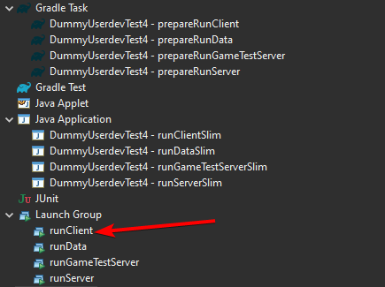

# ForgeGradle 5 -> 6 Migration Primer

This is a high level, non-exhaustive overview on how to migrate your buildscript from ForgeGradle 5 to 6.

If there's any incorrect or missing information, please leave a comment below. Thanks!

## Add Foojay Toolchains Plugin

Gradle now uses the [Foojay Toolchains Plugin](https://github.com/gradle/foojay-toolchains) to manage the Java toolchain. The plugin must be added to the `settings.gradle[.kts]`:

With Gradle DSL:

```gradle
// In settings.gradle
plugins {
    id 'org.gradle.toolchains.foojay-resolver-convention' version '0.5.0'
}
```

With Kotlin DSL:

```kotlin
// In settings.gradle.kts
plugins {
    id("org.gradle.toolchains.foojay-resolver-convention") version "0.5.0"
}
```

## Update Gradle to 8.1.1

First, you need to update your Gradle Wrapper to use 8.1.1. You can find additional information regarding the migration process from 7 to 8 on [Gradle's migration guide](https://docs.gradle.org/current/userguide/upgrading_version_7.html).

This can be done in one of two ways:

### `gradle wrapper`

The preferred option is to use the `gradle wrapper` command with the `--gradle-version` option.

```bash
# Inside root directory of the gradle project
./gradlew wrapper --gradle-version=8.1.1
```

### gradle-wrapper.properties

This method is not recommended, and it should only be used if the `gradlew wrapper` command above fails.

Update the version in the `distributionUrl` property within `gradle/wrapper/gradle-wrapper.properties`. Afterwards run `./gradlew wrapper`.

```properties
distributionUrl=https\://services.gradle.org/distributions/gradle-8.1.1-bin.zip
```

## Update ForgeGradle Plugin Version

After updating Gradle, update the `ForgeGradle` version in your `build.gradle[.kts]` to `[6.0,6.2)`:

With Gradle DSL:

```gradle
// In build.gradle
plugins {
    id 'net.minecraftforge.gradle' version '[6.0,6.2)'
}
```

With Kotlin DSL:

```kotlin
// In build.gradle.kts
plugins {
    id("net.minecraftforge.gradle") version "[6.0,6.2)"
}
```

## Remove `forceExit` from Run Configurations

ForgeGradle has now removed the `forceExit` property in run configurations. Changes to run tasks only apply to the current project and not any subprojects.

### Minor Additions, Changes, Removals

### Reobfuscated Classpath Inheritance

If you were using `classpath.from` within a `reobf*` task configuration to declare extra libraries, the `reobf*` task needed to take into account; it should be migrated to the `libraries.from` property instead.

### Eclipse Launcher Groups

If ForgeGradle is setup such that Eclipse should run the Gradle tasks before starting the game, you must execute the run configuration from the `Launch Group` folder. This is only true if new properties are enabled within the `minecraft` block.



### Removal of `resources` and `classes` in ModConfig

The properties `resources` and `classes` within the `mods` block of a run configuration have been removed from ForgeGradle 6.
