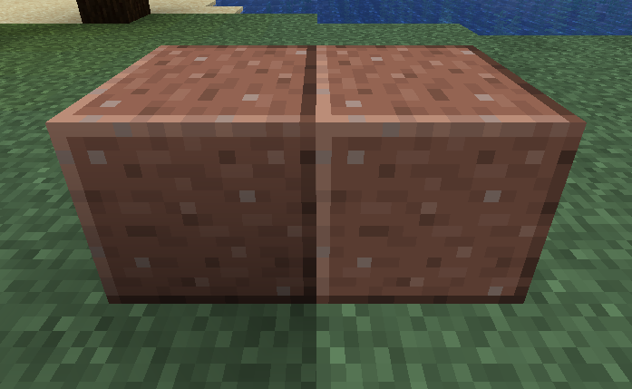

Face Data
=========

In a vanilla "elements" model, additional data about an element's faces can be specified at either the element level or the face level. Faces which do not specify their own face data will fall back to the element's face data or a default if no face data is specified at the element level.

To use this extension for a generated item model, the model must be loaded through the `forge:item_layers` model loader due to the vanilla item model generator not being extended to read this additional data.

All values of the face data are optional.

Elements Model
--------------

In vanilla "elements" models, the face data applies to the face it is specified in or all faces of the element it is specified in which don't have their own face data.

The additional data can be specified in the two ways shown in this example:
```js
{
  "elements": [
    {
      "forge_data": {
        "color": "0xFFFF0000",
          "block_light": 15,
          "sky_light": 15,
          "ambient_occlusion": false
      },
      "faces": {
        "north": {
          "forge_data": {
            "color": "0xFFFF0000",
            "block_light": 15,
            "sky_light": 15,
            "ambient_occlusion": false
          },
          // ...
        },
        // ...
      },
      // ...
    }
  ]
}
```

Generated Item Model
--------------------

In generated item models loaded through the `forge:item_layers` loader, the face data applies to all faces generated from the texture specified for the layer the respective entry is associated with.

The additional data has to be specified at the top level with the entry names in the `forge_data` object being the layer index the respective entry belongs to (in the example, layer 1 will be tinted red and glow at full brightness):
```js
{
  "textures": {
    "layer0": "minecraft:item/stick",
    "layer1": "minecraft:item/glowstone_dust"
  },
  "forge_data": {
    "1": {
      "color": "0xFFFF0000",
      "block_light": 15,
      "sky_light": 15,
      "ambient_occlusion": false
    }
  }
}
```

Parameters
----------

### Color

Specifying a color value with the `color` entry will apply that color as a tint to the quads. Defaults to `0xFFFFFFFF` (white, fully opaque). The color must be in the `ARGB` format packed into a 32-bit integer and can be specified as either a hexadecimal string (`"0xAARRGGBB"`) or as a decimal integer literal (JSON does not support hexadecimal integer literals).

!!! warning
    If the color is specified as a 24-bit integer (no matter the representation), the resulting color will be fully transparent due to the alpha component being 0.

This can be used as a replacement for tinting with [`BlockColor` and `ItemColor`][tinting] if the color values are constant.

### Block and Sky Light

Specifying a block and/or sky light value with the `block_light` and `sky_light` entry respectively will override the respective light value of the quads. Both values default to 0. The values must be in the range 0-15 (inclusive) and are treated as a minimum value for the respective light type when the face is rendered, meaning that a higher in-world value of the respective light type will override the specified value.

The specified light values are purely client-side and affect neither the server's light level nor the brightness of surrounding blocks.

### Ambient Occlusion

Specifying the `ambient_occlusion` flag will configure [AO] for the quads. Defaults to `true`. The behaviour of this flag is equivalent to the top-level `ambientocclusion` flag of the vanilla format.

  
*Ambient occlusion enabled on the left and disabled on the right, demonstrated with the Smooth Lighting graphics setting*

!!! note
    If the top-level AO flag is set to false, specifying this flag as true on an element or face won't be able to override the top-level flag.
    ```js
    {
      "ambientocclusion": false,
      "elements": [
        {
          "forge_data": {
            "ambient_occlusion": true // Has no effect
          }
        }
      ]
    }
    ```

[tinting]: ../../resources/client/models/tinting.md
[AO]: https://en.wikipedia.org/wiki/Ambient_occlusion
[ao_img]: ./ambientocclusion.png